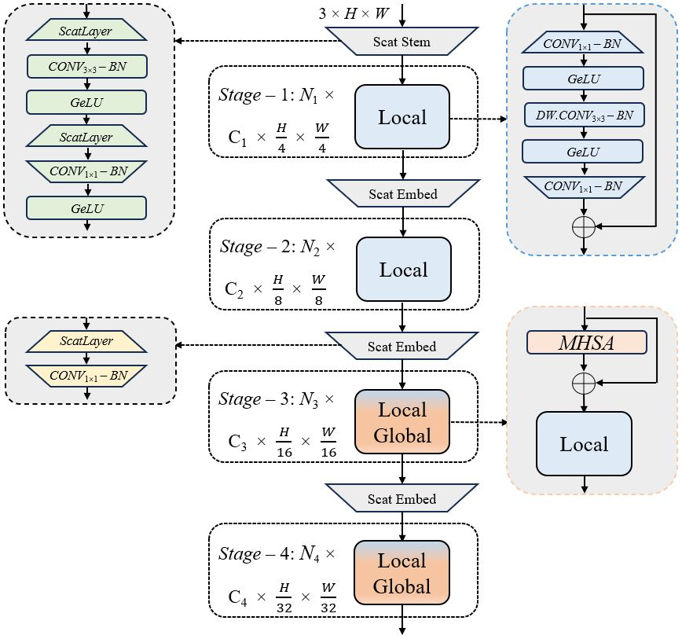

## ScatFormer<br><sub>Enhancing Image Recognition through Wavelet Scattering Features</sub>

<p align="center">
   <br>
</p>

>[Enhancing Image Recognition through Wavelet Scattering Features](docs/ScatFormer.pdf)<br>
>[Khaled Almutairy](https://www.linkedin.com/in/khaledalmutairy)<sup>1</sup>, [Mamoun Alghaslan](https://www.linkedin.com/in/mamoun-alghaslan-96207188/)<sup>1</sup>, [Saeed Anwar](https://scholar.google.com.au/citations?hl=en&user=vPJIHywAAAAJ&view_op=list_works&sortby=pubdate)<sup>1,2</sup> <br>
<sup>1</sup>SDAIA-KFUPM Joint Research Center for Artificial Intelligence,  
<sup>2</sup>Information and Computer Science, King Fahd University of Petroleum and Minerals, Saudi Arabia

<details>
  <summary>
  <font size="+1">Abstract</font>
  </summary>
Building an efficient classifier requires a robust feature extraction method that generates stable image representations across various geometric transformations. Although Convolutional Neural Networks (CNNs) excel in spatial features, they often overlook rich frequency patterns in images. In this study, we explored the integration of the Wavelet Scattering Network to overcome the limitations of CNN-based models in achieving translation invariance and deformation stability. Our investigation focuses on assessing the efficacy of this approach by incorporating it into the EfficientFormerV2 architecture [1] in three different model variants. Our proposed method achieves a 1.68 % improvement in top-1 accuracy compared to EfficientFormerV2 on ImageNet100, a subset of ImageNet-1k comprising 1k randomly selected classes. We believe that integrating the properties of wavelet scattering transforms into existing models can yield more efficient and robust feature representations.
</details>

<br>

## Installation

### Clone the repository
```
git clone https://github.com/KhaledSaud70/ScatFormer.git
cd ScatFormer
```

### Install dependencies
```
pip install -r requirements.txt
```

## Dataset Preparation

Download ImageNet100 dataset using Kaggle:
```
kaggle datasets download -d wilyzh/imagenet100
```

The dataset should be organized as follows:
```
|-- /path/to/imagenet100/
    |-- train
    |-- val
```

## Training

To train the model on a single machine with multiple GPUs:
```
bash dist_train.sh [model_variant] [num_gpus]
```

## Evaluation

To evaluate the model:
```
bash dist_test.sh [model_variant] [num_gpus] [checkpoint_path]
```

## Model Variants

ScatFormer offers four model variants with different complexity-performance trade-offs:
- scatformer_s0: Lightweight variant optimized for efficiency
- scatformer_s1: Balanced model for moderate computational resources
- scatformer_s2: Enhanced model
- scatformer_l: Largest variant for maximum performance

## Results

Performance comparison on ImageNet100:

| Model | Params (M) | GMACs | Top-1 (%) |
|-------|------------|--------|-----------|
| EfficientFormerV2-S0 | 3.26 | 0.39 | 86.78 |
| ScatFormer-S0 (Ours) | 3.22 | 0.43 | 88.46 |

## Acknowledgments

This work builds upon the following excellent repositories:
- [EfficientFormer](https://github.com/snap-research/EfficientFormer) - Base architecture and training framework
- [PyTorch Wavelets](https://github.com/fbcotter/pytorch_wavelets) - Wavelet transform implementation
